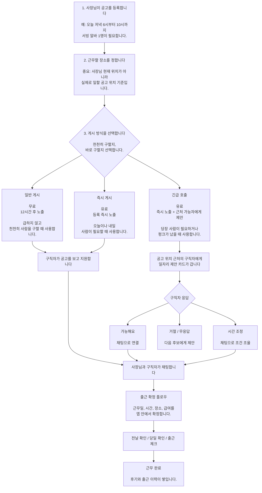
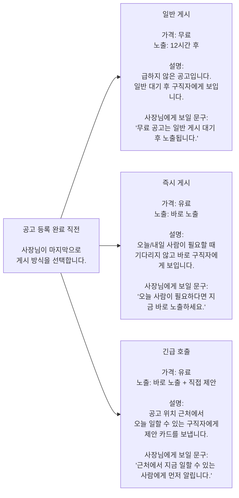
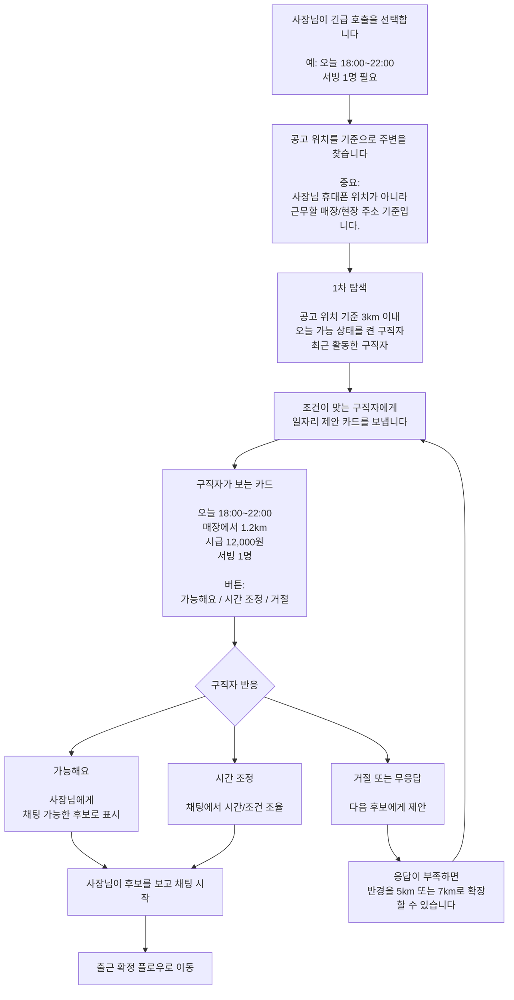
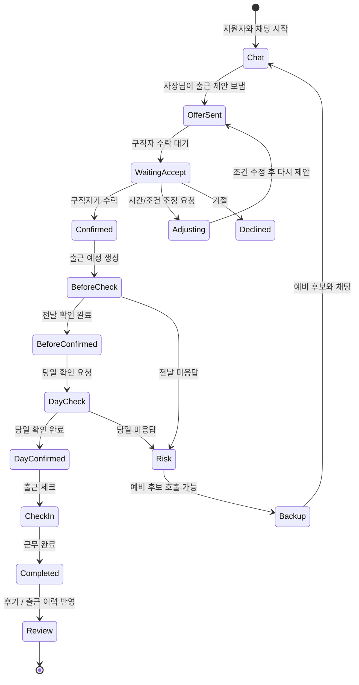
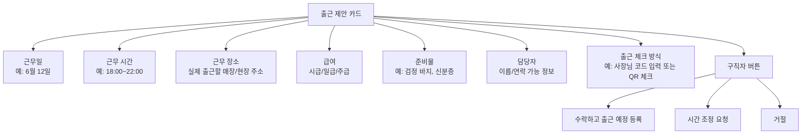
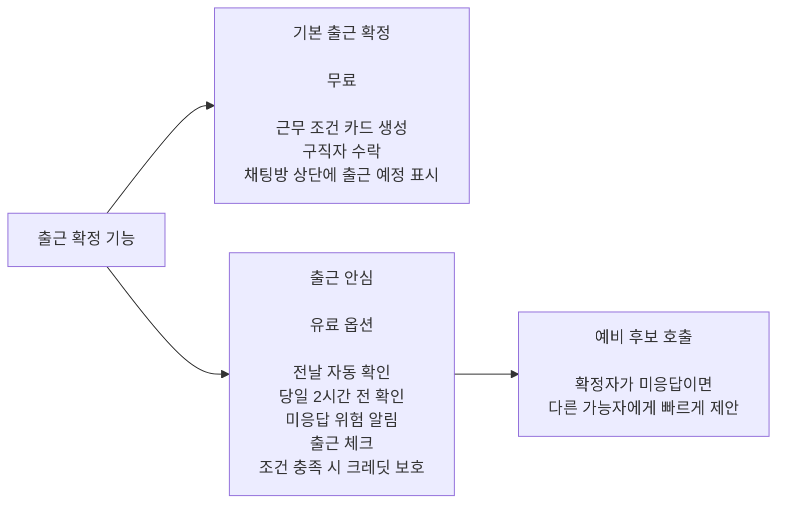
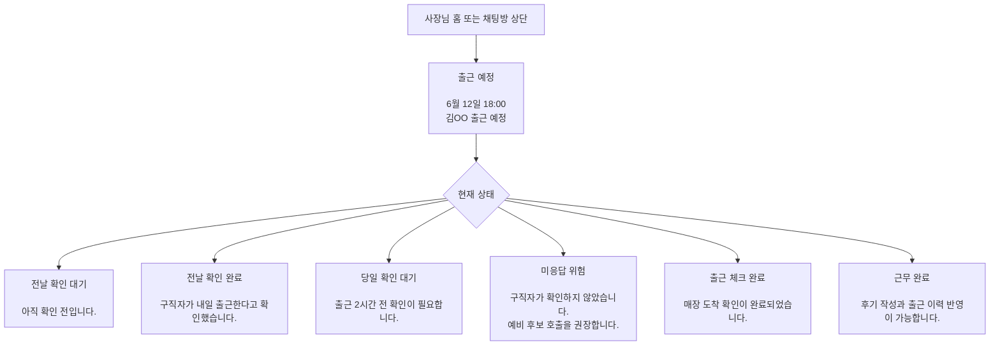
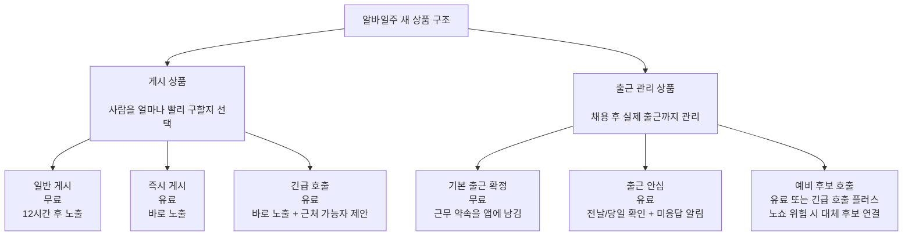

# 알바일주 공고 방식 + 출근 확정 플로우 시각화

이 문서는 사장님이 헷갈리지 않도록, 알바일주의 새 공고 방식과 출근 확정 흐름을 한눈에 이해할 수 있게 정리한 자료입니다.

핵심은 간단합니다.

```text
무료 공고 = 기다리는 공고
유료 공고 = 바로 움직이는 공고
출근 확정 = 말로만 약속하지 않고 앱 안에 근무 약속을 남기는 기능
```

## 1. 전체 흐름 한 장 요약



## 2. 공고 방식 상세 설명



## 3. 긴급 호출 상세 흐름

긴급 호출은 단순한 상단 광고가 아닙니다.  
공고 위치 근처의 구직자에게 “오늘 가능하신가요?”를 직접 묻는 기능입니다.



## 4. 구직자에게 가는 제안 카드 예시

```text
[근처 일자리 제안]

오늘 18:00 ~ 22:00
공고 위치에서 1.2km
시급 12,000원
서빙 1명

사장님이 근무 가능 여부를 확인하고 싶어 합니다.

[가능해요] [시간 조정] [거절]
```

주의할 점:

```text
처음부터 채팅방을 강제로 열면 구직자가 피로감을 느낄 수 있습니다.
먼저 제안 카드를 보내고,
구직자가 가능하다고 눌렀을 때 채팅을 여는 방식이 좋습니다.
```

## 5. 출근 확정 플로우 상세

출근 확정은 단순한 카드가 아니라, 채팅 이후 근무 완료까지 이어지는 상태 관리입니다.



## 6. 출근 확정 카드 안에 들어갈 내용



## 7. 무료 출근 확정과 유료 출근 안심의 차이



## 8. 사장님 화면에서 보이면 좋은 상태



## 9. 상품 구조 정리



## 10. 어르신 사장님에게 설명하는 한 문장

```text
무료로 올리면 조금 기다렸다가 공고가 올라가고,
급하면 돈을 내고 바로 올릴 수 있습니다.

더 급하면 근처에서 오늘 일할 수 있는 사람에게
알바일주가 먼저 제안해드립니다.

채팅으로 말만 하고 끝나는 게 아니라,
출근 날짜와 시간을 앱에 약속으로 남기고
전날과 당일에 다시 확인해서 펑크를 줄입니다.
```

## 11. 최종 한 줄 구조

```text
공고 등록
→ 일반 게시 / 즉시 게시 / 긴급 호출 선택
→ 지원자 또는 근처 가능자와 채팅
→ 출근 확정 플로우
→ 전날 확인 / 당일 확인 / 출근 체크
→ 근무 완료 / 후기 / 출근 이력
```

